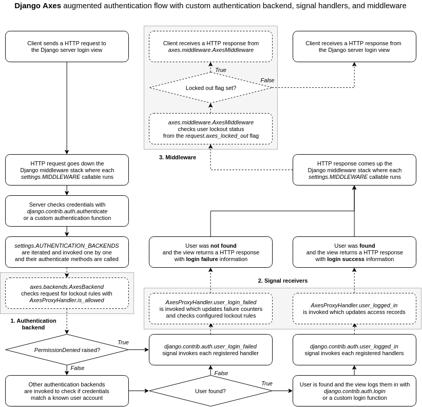

.. _architecture:

Architecture
============

Axes is based on the existing Django authentication backend
architecture and framework for recognizing users and aims to be
compatible with the stock design and implementation of Django
while offering extensibility and configurability for using the
Axes authentication monitoring and logging for users of the package
as well as 3rd party package vendors such as Django REST Framework,
Django Allauth, Python Social Auth and so forth.

The development of custom 3rd party package support are active goals,
but you should check the up-to-date documentation and implementation
of Axes for current compatibility before using Axes with custom solutions
and make sure that authentication monitoring is working correctly.

This document describes the Django authentication flow
and how Axes augments it to achieve authentication and login
monitoring and lock users out on too many access attempts.

Django Axes authentication flow
-------------------------------

Axes offers a few additions to the Django authentication flow
that implement the login monitoring and lockouts through a swappable
**handler** API and configuration flags that users and package vendors
can use to customize Axes or their own projects as they best see fit.

The following diagram visualizes the Django login flow
and highlights the following extra steps that Axes adds to it with the
**1. Authentication backend**, **2. Signal receivers**, and **3. Middleware**.

         with custom authentication backend,
         signal receivers, and middleware

When a user tries to log in in Django, the login is usually performed
by running a number of authentication backends that check user login
information by calling the ``authenticate`` function, which either
returns a Django compatible ``User``  object or a ``None``.

If an authentication backend does not approve a user login,
it can raise a ``PermissionDenied`` exception, which immediately
skips the rest of the authentication backends, triggers the
``user_login_failed`` signal, and then returns a ``None``
to the calling function, indicating that the login failed.

Axes implements authentication blocking with the custom
``AxesBackend`` authentication backend which checks every request
coming through the Django authentication flow and verifies they
are not blocked, and allows the requests to go through if the check passes.

If the authentication attempt matches a lockout rule, e.g. it is from a
blacklisted IP or exceeds the maximum configured authentication attempts,
it is blocked by raising the ``PermissionDenied`` excepton in the backend.

Axes monitors logins with the ``user_login_failed`` signal receiver
and records authentication failures from both the ``AxesBackend`` and
other authentication backends and tracks the failed attempts
by tracking the attempt IP address, username, user agent, or all of them.

If the lockout rules match, then Axes marks the request
as locked by setting a special attribute into the request.
The ``AxesMiddleware`` then processes the request, returning
a lockout response to the user, if the flag has been set.

Axes assumes that the login views either call the ``authenticate`` method
to log in users or otherwise take care of notifying Axes of authentication
attempts and failures the same way Django does via authentication signals.

The login flows can be customized and the Axes
authentication backend, middleware, and signal receivers
can easily be swapped to alternative implementations.
